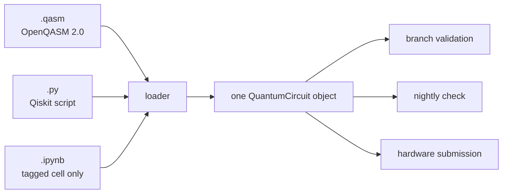
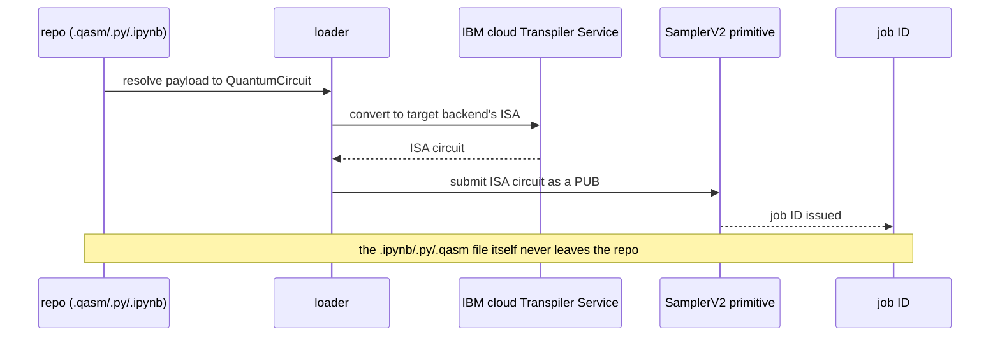
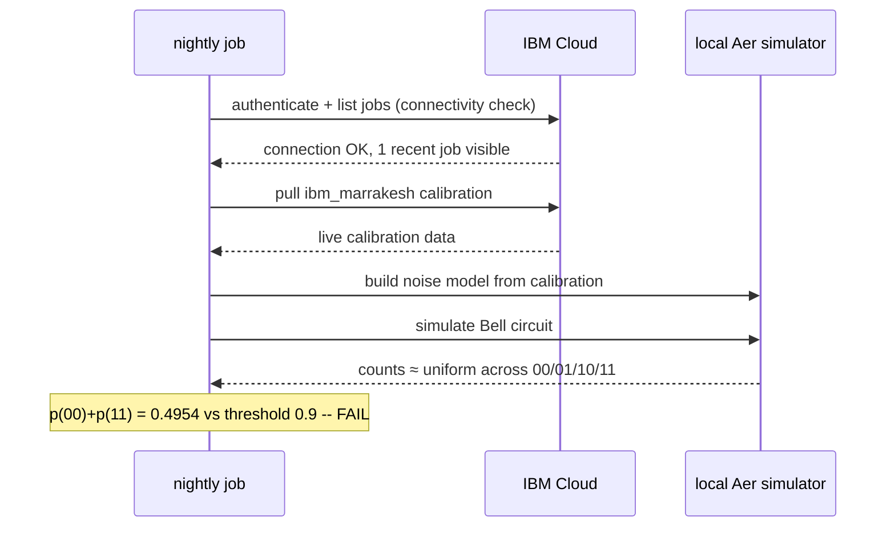
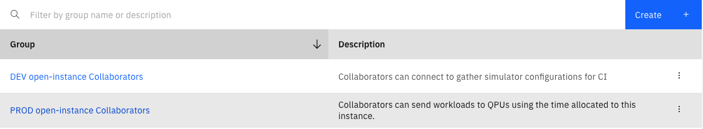
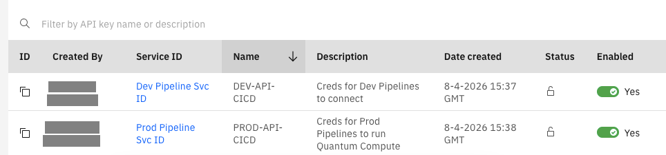
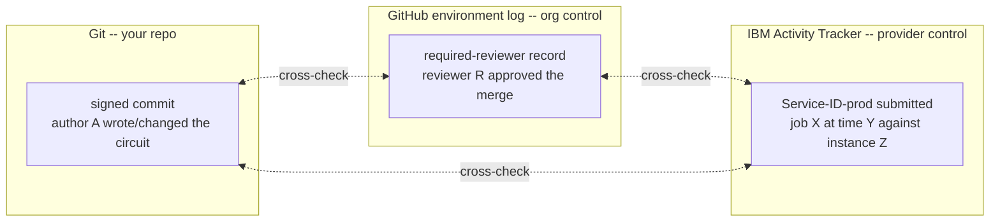

# Governing Quantum Job Submission in CI/CD Pipelines: An Accountability Model

# Abstract

Most discussion of "quantum" and "security" concerns the cryptographic threat — a future cryptographically-relevant quantum computer breaking public-key encryption, and the migration to post-quantum cryptography. This document examines a largely undiscussed problem: the conventional to quantum compute interface is an ordinary CI/CD attack surface that spends real money executing workloads obfuscated from human reviewers. When automated, a bad implementation pattern can become a wasteful, hidden, recurring cost center.

The account is written to connect concepts framed as a constructed reference scenario — a CI/CD practitioner wiring an opaque quantum circuit into a GitHub Actions pipeline and IBM Quantum. The problem is reasoned through in the order it plausibly unfolds: branch validation without real hardware; job submission on merge; a configuration model that separates execution target from spend authority ; a scheduled nightly run; and an accountability model for the day an approval is fumbled.

Several findings emerge. Circuit validation requires no quantum hardware: structural checks plus local noise-model simulation, reduced to a single gateable scalar, catch the failures that matter. The contemporary execution model submits a device-specific ISA circuit rather than uploading a persistent server-side program, which relocates the durable artifact into version control. A scheduled job built to reduce cost doubles as a zero-quota device-health sensor, measuring device noise without executing on hardware. Most substantively, the document proposes a **three-identity accountability model** — author, approver, and submitter — held in three independent systems so that the audit trail survives on infrastructure outside any single team's control.

The document is explicit about its limits and leaves open questions in the margins throughout. It argues that the CI/CD governance exposure of quantum submission pipelines is a present-day operational concern worth naming.

# Keywords

quantum computing, CI/CD, DevSecOps, IBM Quantum, Qiskit, software supply chain, governance, accountability, audit trail, identity and access management, GitHub Actions, platform engineering

# Running quantum jobs through CI/CD, as a newcomer

*This is a constructed reference scenario for reasoning about the emerging operational problem of wiring an unfamiliar, expensive workload into a delivery pipeline. The reasoning, the mistakes, the fixes — all constructed for the exercise, grounded in real experience standing up CI/CD for technology. I am writing as someone who knows CI/CD and is learning quantum computing alongside it. I've left open questions in the margins on purpose.*

The real subject is an ungoverned, opaque, money-spending activity when automated inside a CI/CD delivery pipeline. This paper seeks to relate concepts that should be shared between DevOps practitioners and quantum circuit engineers to make the most out of this new resource.

---

## The situation

A data scientist on the team has written a quantum circuit. They want it run on real quantum hardware. The business has signed off and your team has received access to quantum computing resources, including user IDs. Nobody else on the team knows much about quantum computing.  

What the team *does* know is CI/CD. GitHub Actions, branches, pull requests, reviews, merges, secrets, cron. So the question worth working through is narrow and practical: **how do you take an opaque circuit from a colleague and get it onto a quantum computer safely, using the delivery machinery you already trust for everything else?**

This walks through that scenario roughly in the order it would plausibly unfold. It's deliberately a beginner's account. The circuit included in this repository is a placeholder for "some quantum thing the team doesn't understand." To a DevOps team seeking to apply governance, the interesting part is the pipeline we build around it.

The scientist checks the circuit into a branch. The team wants it validated. When the branch is approved and merged, they want the job to run. Later they discover that running during business hours costs too much, so they add a nightly job. Each step surfaces something worth learning.

---

## Part 1 — Validate the circuit on a branch

The first job is the one everyone reaches for: run something on every push to a branch so a bad change gets caught before review. In normal software this is a test suite. What's the equivalent for a quantum circuit?

 It's expensive to use real quantum hardware to catch a malformed circuit or a circuit that's drifted from what it's supposed to compute. While quantum compute times are very fast, every shot (an execution of the circuit) costs money and workload queue times can be lengthy. We can provide a sufficiently high level of confidence by performing validation within the pipeline during the continuous integration phase.

### What the scientist actually checks in

Before validation itself, there's a decision about what the payload even *is* — what file the scientist commits to the branch. 

For interoperability and demonstration, the pipeline here accepts three, treating them as interchangeable:

- **An OpenQASM 2.0 file** (`.qasm`) — the circuit as portable assembly-like source.
- **A Qiskit source file** (`.py`) — a small module exposing a function that returns the circuit.
- **A Jupyter notebook** (`.ipynb`) — with one code cell tagged as the circuit; the rest of the notebook is scratch and is ignored.

A small loader resolves whichever of the three the scientist committed into an in-memory circuit object, and the validation job, the nightly job, and the hardware-submission job depend only on that object. A structurally identical circuit is created from any of the three formats.



If the circuit has a `.py` extension, the pipeline just runs code the scientist wrote. For the notebook (`.ipynb`), that's resolved by executing *only* the single cell tagged as the circuit, never the whole notebook. The standard way to do this is ensuring the metadata.tags list contains "circuit" for the cell to be executed. Exploratory cells, half-finished experiments, and stray imports never run in CI. 

So the branch-validation job does **not** touch a real quantum processor. It does three cheaper things that provide direct value:

1. **Structural checks.** Does the circuit build? Transpilation against a generic local target — not a specific real device, provides a cheap sanity check. A malformed payload — broken OpenQASM, a notebook with no tagged circuit cell, a circuit with no measurements — fails here, early and cleanly, before anything expensive.
2. **Local simulation.** Run the circuit on a local statevector or noise-model simulator and check the output distribution is what's expected. For the Bell state circuit in this repository, the expected result is roughly half `00` and half `11`, with essentially no `01` or `10`. That correlation is the fingerprint of the circuit doing its job.
3. **A correlation assertion.** Reduce the whole thing to one pass/fail number. For a Bell circuit, this is `p(00) + p(11)` compared against a threshold. A healthy Bell state pushes that number toward 1.0. A broken circuit — or a noisy simulation — collapses it toward 0.5, which is what four equally likely outcomes look like: no entanglement signal at all.

### The DevOps concern: understanding the physics shouldn't be a prerequisite for running the pipeline

A real constraint shows up immediately. The scientist's code is driven by a `Makefile`, but the CI configuration shouldn't depend on the internals of that Makefile. The moment the workflow YAML has to know *how* the circuit is built, the delivery pipeline is coupled to physics code nobody on the DevOps side can maintain.

This implementation creates a contract between the two roles:

- **The DevOps side passes inputs in.** Backend name, threshold, shot count, instance, channel, and execution mode go in as environment variables and workflow inputs. 
- **The quantum side (the scientist's code, behind Make) passes one clean signal out.** An exit code for pass/fail, plus a machine-readable result file written to a known path. The workflow reads a small JSON blob with the measured numbers, not scraped log text.

The person writing CI should not need to edit the Makefile, and the person writing circuits never edits YAML. That boundary is enforced through subsequent workflow actions.

---

## Part 2 — Run the job on merge

When the branch is approved and merged to `main`, the scientist wants the job to actually run — on real quantum hardware this time. This is the heart of the whole exercise, because this is the step where an opaque circuit, written by someone whose work can't be checked, executes against a paid resource on infrastructure the team doesn't own.

The interesting governance questions live where there is external compute cost.

### What actually gets submitted 

 You take your circuit, convert it locally to the target device's instruction set, and submit *the converted circuit itself* to one of IBM's predefined execution primitives. There's no persistent server-side program living in the cloud.

The practical consequence for the pipeline changes where the "program" is understood to live:

- **The authoring format file (`.qasm`/`.py`/`.ipynb`) the scientist committed never goes to IBM.** It lives in Git, under version control and review. 
- **What crosses the wire is the ISA circuit** — the circuit converted to the specific device's native instruction set. The ISA circuit is the wire format.
- **The persistent handles on IBM's side are the instance and the job ID.** The instance (a cloud resource name) is the execution context the credentials point at; each submission produces a job ID that persists as the record of that run. 



During real hardware submission, the exact ISA circuit matters down to the gate. For this reason, we hand that specific conversion to IBM's own cloud-hosted Qiskit Transpiler Service, rather than a local pass manager. This means the ISA circuit that actually runs was produced by the same system that's about to execute it — not a local approximation.

### Blocking first, because it is simpler and correct

There are two broad ways to run a job in CI:

- **Blocking (synchronous):** submit the job, then hold the workflow open and poll until it finishes. If a predetermined timeout is exceeded, the exit with a timeout error. The run's success or failure inherits the job's success or failure. The cost is a workflow that sits and waits, consuming a runner minute-for-minute while the job sits in a queue.
- **Asynchronous:** submit the job, record its ID, and let the workflow exit immediately. A separate process — another workflow, a scheduled reaper, a webhook consumer — collects the result later. More complexity, but the runner queue time becomes less important.

For a single circuit, on merge, blocking is the right call. Qiskit Runtime hands over a job object through the Sampler primitive; polls it to completion and reads the result. The whole execution fits in a single workflow step with a timeout guardrail. Until volume forces the issue, additional complexity is not needed.

### When blocking stops being the answer

Blocking breaks down along predictable lines, primarily around the scarcity of quantum resources.

- **Queue time dominates.** If jobs routinely sit in a device queue for a long time, you're paying for idle self-hosted runner minutes to watch a spinner. That's the first real pressure toward async. Using GitHub-hosted runners might alleviate this pressure for the time being.
- **Volume grows.** One circuit blocking is fine. Fifty circuits each blocking a runner is a self-inflicted outage.
- **The job outlives the runner.** GitHub-hosted runners have time limits. A job that could exceed them can't be run to completion in a single blocking step.

The asynchronous upgrade path, when it's needed, is simple: the submit step writes the job ID to durable storage and exits. A decoupled workflow — triggered on a schedule, or by a callback — reaps finished jobs by ID, records results, and reports. When submission volume gets high enough to need backpressure and retries, a **message queue** is the natural solution: submissions become messages, a worker pool drains them at whatever rate the hardware and the budget allow, and results flow back onto another queue. The asynchronous path ultimately offers greater resilience and can offer increased confidence that the hard-earned and very expensive quantum circuit run results will be captured.

### The mistake almost shipped: triggering on every merge, not every circuit change

A fair question surfaces later: is the team paying for a quantum job every time someone merges a README fix? The fix is a `paths:` filter on the trigger, scoped to the circuit payload directory and the small set of pipeline files that decide what actually gets submitted. Spend should track circuit changes, not merge cadence.

---

## Part 3 — The configuration model: two separate axes 

Once real hardware and real money enter the picture, there's a decision to make about how environments, credentials, and "simulator vs. real hardware" relate. Getting this wrong first, and then untangling it, was probably the most useful conceptual moment in the exercise — worth laying out the mistake, not just the answer.

### The mistake: binding "simulator-ness" to the environment

The obvious design is: *dev runs on a simulator, prod runs on real hardware.* Environment name decides everything. This separation is clean until it isn't.

The problem is that this collapses two genuinely independent things:

- **Where the work runs** — a local simulator, or a real quantum processor.
- **Which credentials and quota it runs under** — a free/open plan with no real spend, or a paid instance with real money and real audit weight behind it.

Environment (dev/test/prod) is really a proxy for the *second* axis — who is allowed to spend, and how much. It's not fundamentally about simulator-vs-hardware. The moment "dev means simulator" is hardcoded into the environment's identity, the first person who wants a real-hardware smoke test from a non-prod environment is fighting the abstraction.

### The fix: environment carries identity and permission; a separate switch carries sim-vs-hardware

The cleaner model keeps the axes apart:

- **Environment** carries *credentials and approval gates*. Who can spend, and what has to happen before they can.
- **A separate execution-target setting** carries *simulator vs. real hardware*. Its default is set per environment — dev defaults to simulator, prod defaults to hardware.
- **Backend name** is its own independent input. Even simulator mode needs to know *which device's calibration* to model; hardware mode needs to know *which device* to pin, or whether to fall back to "least busy." Orthogonal to both of the above.

The truth table that falls out:

| Environment | Default execution target | Credential | Approval gate | What actually happens |
|---|---|---|---|---|
| dev | simulator | free / open instance | none | Local noise-model simulation from the named backend's live calibration; zero hardware spend |
| dev (overridden) | hardware | free / open instance | none | Real submission, but on the low- or no-cost instance — bounded blast radius |
| prod | hardware | paid instance | required reviewers | Real job on pinned hardware, after a human approves the spend |

The reason to prefer this over a simpler "one credential, gate on branch name" approach is that the only thing between a merged pull request and real spend is application logic someone would have to write and maintain — a check that refuses to submit unless it's running on `main`. With two GitHub Environments, the spend gate is platform-native: the paid credential is simply unreachable without passing an approval, with no bypass in application code to get wrong. For a team that openly admits the quantum execution is a black box, moving the safety boundary *out* of code they are writing and *into* the platform's permission model is the more defensible design.

### Why two credential pairs, specifically

This is where it stops being about spend and starts being about accountability, which deserves its own section. The short version: dev and prod each get their *own* token-and-instance pair, backed by distinct identities on the provider side — not two differently-named secrets sharing one underlying identity. The reason is in Part 5.

---

## Part 4 — The nightly job, and the night it turned red

Running during business hours costs too much — both in money and in contention with whatever else wants the hardware during peak times. So the plan is ordinary: add a `schedule:` trigger, run the job overnight when demand and cost are lower. In CI/CD terms this is the most boring thing imaginable. A cron line.

Then, in this scenario, the nightly run goes red — and it teaches the single most interesting thing in the whole exercise.

### What the failure looks like

The job fails in well under a minute. Here's the shape of what comes back:

```
qiskit_runtime_service._discover_account: WARNING: Loading account with the given token. A saved account will not be used.
FAIL: measured correlation below threshold
backend: aer-noise[ibm_marrakesh] (cloud connection verified, 1 recent job(s) visible), shots: 4096
counts: {'11': 978, '10': 1024, '00': 1051, '01': 1043}
p(00) + p(11) = 0.4954 (threshold 0.9)
```

Read that carefully, because the details rewrite what the job was even doing.

First: `aer-noise[ibm_marrakesh]`. This run is **not** executing on the physical processor. It's running locally on a simulator, using a **noise model derived from `ibm_marrakesh`'s live calibration data.** The pipeline authenticated, confirmed the cloud connection was live (it even reports a recent job as visible), pulled the device's current calibration, built a simulated model of how noisy that device is *right now*, and ran the Bell circuit against that model.

Second: the counts are almost perfectly uniform — roughly a quarter each across `00`, `01`, `10`, `11`. So `p(00) + p(11)` comes out to `0.4954`, against a threshold of `0.9`. The entanglement signal is gone. Not degraded — gone. The simulated correlation has collapsed to what four-way-random noise looks like.

Third, and this is the part worth sitting with: **the failure is surfaced by connecting and pulling calibration, not by running on the quantum computer.** It costs essentially nothing in hardware time. The device's bad state is learned without spending a cent of quota to find out.



No step in that chain touches the physical processor — the whole failure is diagnosed from calibration data and a local simulation.

### Why it happens — the maintenance window

The cause, once dug into, is mundane and specific: **the device is mid-recalibration.** Heron-generation processors go through calibration cycles, and for a window afterward the device is stabilizing. The freshly-pulled calibration during that window is degraded enough that even the *simulated* correlation — the model built from those numbers — collapses to noise. The nightly cron had been scheduled squarely inside that window.

The fix is simple: **move the schedule earlier, out of the recalibration window, into a clean two-hour band where the device is stable.** A one-line change to a cron expression. But the lesson underneath changes how to think about the whole pipeline.

### The thing not expected: the nightly attempt is a free sensor

Here's what dawns out of this. That nightly job, built purely as "run the workload cheaply overnight," is accidentally doing something more valuable than running the workload. **Just by connecting and pulling calibration, it's measuring the health of the device** — its noise, the correlation it can sustain, its availability — every single night, for free, without consuming quota.

So the proposal worth putting on the table: what if the nightly connection is treated as a **deliberate data-gathering pass** rather than just a cheap execution slot? Every night, authenticate, pull calibration, build the noise model, record the correlation floor and availability. Over time that accumulates a picture of when the device is healthy and when it isn't — a cheap, standing sensor for device quality, built entirely out of the connection step, spending no hardware time at all. A failed run isn't just a red build; it's a data point.

That reframing — from "the nightly job runs the circuit" to "the nightly job senses the device, and running the circuit is almost a side effect" — is worth testing against people with more hands-on device experience.

---

## Part 5 — Accountability: do not collapse the identity model

This is the part that matters most to get right, sitting at the intersection of CI/CD (familiar ground) and governance and quantum.

Suppose the worst reasonable case: someone in the organization fumbles an approval and lets a job go out that shouldn't have. Maybe the circuit was changed to something it shouldn't be. Maybe an approval was rubber-stamped. When that happens — not if, when, at some organization, eventually — the traceability story needs to already be written: exactly *who wrote what, who approved it, and whose identity actually ran it,* from records that don't all live in one system under one team's control.

The failure mode most worth avoiding is **collapsing those identities into one.** If everything runs under a single shared token, then "who ran this job" has exactly one answer for every job ever, and the trail is worthless the moment it's needed. So the model keeps three distinct identities, in three independent systems, and never merges them:

**1. Who authored or changed the circuit.**
Git authorship, with signed commits. The scientist's identity, cryptographically attached to the artifact itself. This is what makes "we trust him" *attributable* instead of ambient — the trust is named, and every change to the circuit is tied to a signature. If a circuit becomes something it shouldn't be, the commit history reflects who changed it.

**2. Who approved the spend.**
The GitHub Environment required-reviewer record. When the run-on-merge job targets the prod environment, GitHub physically pauses it until a designated human approves. That approval is logged. **But** — and this matters — that record is a claim *by GitHub*, living in the CI platform's logs, under the organization's control, and mutable by a sufficiently privileged insider. It's necessary, though sufficient alone. A CI platform attesting to its own approvals is not the same as an independent attestation.

*A gap worth naming inside this same point.* "Who approved the spend" can look like the whole approver story, but it isn't. The environment's required-reviewer setting lives in Settings → Environments, not in the repository — nothing in a diff shows who's allowed to approve a prod run, or when that list last changed; it takes admin access and some digging to find out. It answers "should this specific execution spend money right now," asked at run time, after the circuit has already merged. What's missing is an answer to the earlier question: who is accountable for having actually looked at the circuit *before* it merged at all. Ordinary branch protection can be satisfied by any reviewer with write access, which isn't the same as "a named, quantum-literate person vouched for this diff."

*A `CODEOWNERS` file* scoping the circuit and pipeline paths to specific named owners, with branch protection set to require their review, closes that gap. The difference that matters: `CODEOWNERS` is a checked-in file. Its own changes go through review. Every approval it requires is attached permanently to the pull request, visible to anyone reading that PR later — not buried in an admin-only settings page. So the model ends up with two gates, not one, answering two different questions: `CODEOWNERS` says a specific named person is accountable for this diff being sound; the environment's required reviewers say a specific named person authorized this specific dollar amount to go out right now. Both matter — collapsing them back into "well, someone approved it somewhere" is the same mistake this section opened by warning against, just one level up.

**3. Whose provider-side identity actually submitted the job.**
This is the piece that makes the trail robust, and it's where IBM Cloud's identity management does real work. The submission runs under an **IBM Cloud IAM Service ID** — a non-human identity meant exactly for an application (here, the CI runner) to authenticate as — carrying a **scoped Service ID API key**, not a human's personal token and not a broad organization-wide token. Because it's the provider's own identity system, IBM's audit records — independent of GitHub entirely — capture which identity submitted which job against which instance.

Concretely, on IBM Cloud, the relevant machinery is real and quantum-aware:

- **Service IDs** exist precisely to let an application outside IBM Cloud authenticate to IBM Cloud services without being a person. A Service ID API key authenticates the runner as that service identity. The key can be scoped narrowly, and can even be issued for limited use, bounding the failure domain if it leaks.
- **Access groups** scope *which service instances* a given identity can reach, and quantum actions are first-class IAM actions — an administrator can write policy around actions like `quantum-computing.job.delete`. So "which identity may submit or delete a quantum job, on which instance" is enforced by IBM, as policy.
- 
- **Activity Tracker** captures audit records for API calls made against IBM Cloud resources, in the standardized Cloud Auditing Data Federation (CADF) format. This is the provider-side, out-of-your-control trail: it records that a specific Service ID submitted a specific job at a specific time against a specific instance, regardless of what CI logs say — in a standard schema, not a proprietary one.

This isn't hypothetical machinery — it's what the IBM Cloud console actually shows once `dev` and `prod` each have their own Service ID, scoped by their own access group:





Now put the three together for the bad-day scenario. A job went out that shouldn't have. The story isn't "hoping GitHub's logs are intact." It's:

- The **signed commit** shows author A wrote (or altered) the circuit.
- The **GitHub environment log** shows reviewer R approved the merge that triggered it.
- **IBM's Activity Tracker** shows Service-ID-prod submitted job X at time Y against instance Z.

Three independent systems, three identities, one correlatable trail. Any two of them can be cross-checked against the third. Collapse any two — one shared token, or approval and submission under the same identity — and the ability to cross-check is gone, which is the entire value.



No solid line connects the three boxes on purpose — nothing in one system depends on or feeds the others. That absence of a direct link is what makes the dotted cross-checks meaningful; collapse any two identities into one and there is nothing left to check.

**This is also the real reason for two credential pairs.** Distinct Service IDs per environment mean the *provider-side* audit trail can distinguish "this ran under the gated prod identity" from "this ran under the ungated dev identity" **without trusting GitHub at all.** The identity boundary is enforced at IBM, mirrored at GitHub, and the two have to agree with each other. Two differently-named secrets sharing one underlying identity would look fine in GitHub and be invisible in IBM's trail — exactly the collapse worth avoiding. The two pairs aren't about spend limits; they're about keeping the accountability trail legible on the side you don't control.

---

### Sidebar: quantum jobs as an ordinary — but expensive — attack surface

Something worth raising carefully, since it's not clear this is being talked about in the right frame.

Almost the entire current conversation about "quantum" and "security" is about one thing: the cryptographic threat. A future, cryptographically-relevant quantum computer breaking today's public-key encryption; "harvest now, decrypt later"; the migration to post-quantum cryptography. This is real, it's regulatory, bodies like NIST and CISA are driving hard timelines, and it's thoroughly covered elsewhere.

The thing rarely discussed is almost the inverse, and it's far more mundane. It's not "quantum breaks our crypto." It's: **a quantum-cloud credential is just an API credential with a compute resource and a dollar-denominated scope of impact attached, and CI/CD is the thing holding it.** Quantum compute can be wired into delivery pipelines with roughly the same casual trust as a linter — and unlike a linter, *nobody approving the job can read what it does.* The circuit is opaque to the reviewer. The cost of a fumbled approval isn't a bad deploy rolled back in minutes; it's real spend against a credential, executing whatever the circuit actually encoded, on hardware nobody owns or can inspect. While it's true that execution times are shorter than a beginner like myself anticipates (about 2 seconds for the Bell circuit), larger circuits' compute bill can add up quickly.

Worth being precise about what this is and isn't claiming, because it'd be easy to dress this up as the cryptographic threat and lose the thread. This is *not* claiming quantum jobs break credentials or crypto. It's a narrower operational question: as quantum submission pipelines proliferate inside ordinary engineering orgs, is the *pipeline itself* — the credential, the approval gate, the opaque-workload problem — getting the same governance scrutiny as any other system that can spend money and run code nobody can read? The honest impression is often not, mostly because the whole topic gets filed under "quantum, i.e. someone else's problem for now," when the CI/CD exposure is a today problem for anyone who could be handed this task.

That impression is exactly the accountability model in Part 5: keep the three identities separate so that when — not if — someone fumbles an approval, the trail survives on infrastructure outside your own control. Open questions worth sitting with:

- Is this already a recognized category with existing literature?
- Is the three-identity, don't-collapse-the-trail model the right shape, or over- or under-built?
- Is "opaque expensive workload approved by someone who can't read it" a problem existing controls already cover, or a genuine gap worth naming before these pipelines are everywhere?

Better to start this conversation a little too early and be told it's already handled, than have it start after the first expensive mistake.

---

## What this exercise settles, compressed

In the order that mattered most:

- **Validation does not need real hardware.** Structural checks and local simulation catch the things that actually break. Reduce correctness to one scalar you can gate on.
- **Let the scientist pick their format; make the pipeline format-agnostic.** Accept the circuit as OpenQASM, a Qiskit script, or a notebook, and resolve all three to one circuit object behind a loader. Everything downstream depends on the object, not the format. If you accept notebooks, run only the one tagged circuit cell, never the whole notebook.
- **Draw a hard contract between the CI role and the quantum code.** Inputs in as env vars and workflow inputs; one clean signal out as an exit code plus a machine-readable result file. The person writing YAML should never edit the build; the person writing circuits should never edit YAML.
- **You do not upload a program; you submit an ISA circuit.** The payload file lives in the repo as the durable artifact; what goes to IBM is the circuit converted to the target device's instruction set, and the job ID is the receipt. For the real hardware path specifically, let IBM's own cloud transpiler service do that conversion, rather than a local approximation of what a given device expects — cheaper local checks (branch validation, the nightly noise-model check) can keep using a local pass manager, since neither touches a real device end-to-end.
- **Block first. Go async only when queue time or volume forces it** — and design the submit step to produce a job ID and a result file from day one, so async is an extension and not a rewrite.
- **Keep two axes separate:** environment carries credentials and approval; a separate switch carries simulator-vs-hardware; backend is its own input. Do not bind "simulator-ness" to the environment name.
- **Put the spend gate in the platform, not in application code.** A GitHub Environment with required reviewers makes the paid credential unreachable without approval, with no bypass logic to get wrong.
- **Scope the spend trigger to what can actually change the spend.** "Push to main" is not the same condition as "the circuit changed." Filter the trigger to the payload and pipeline paths, or every unrelated merge quietly spends money and trains reviewers to stop reading approval requests.
- **Separate "who reviewed the change" from "who authorized the spend."** They're different questions asked at different times. A checked-in `CODEOWNERS` file makes the first one visible in every PR, permanently — an environment's required-reviewer setting, config-only and admin-gated, shouldn't carry both jobs alone.
- **Avoid device maintenance windows.** Schedule around recalibration, or a nightly cron landing mid-recalibration will read as a collapse to noise that has nothing to do with the pipeline.
- **The nightly connection is a free sensor.** Pulling calibration measures device health without spending quota. Worth treating as deliberate data-gathering, not just a cheap run slot.
- **Do not collapse the identity model.** Author (signed commit), approver (CODEOWNERS plus the GitHub environment log), and submitter (IBM Service ID, recorded in Activity Tracker) stay three separate identities in three independent systems. That's what makes the trail survive a bad day.

The two threads left most open: whether the nightly calibration pull is a meaningful standing health signal or just noise, and whether the CI/CD exposure of quantum pipelines is a governance gap worth naming now or one already handled elsewhere.
